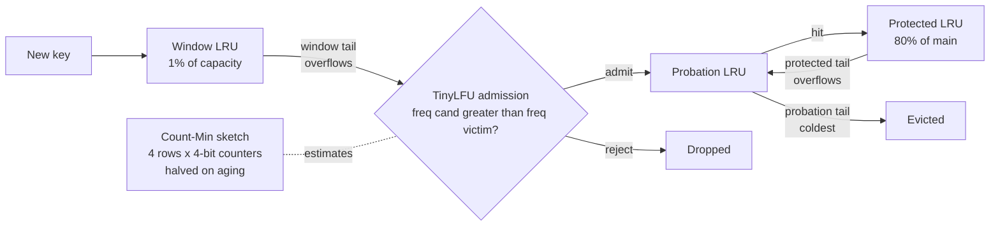
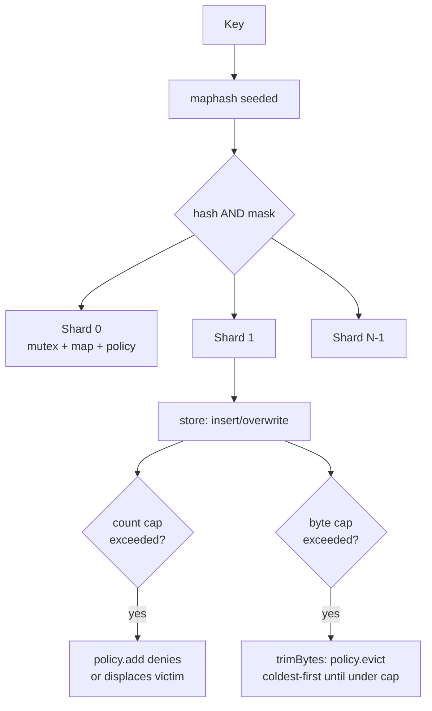
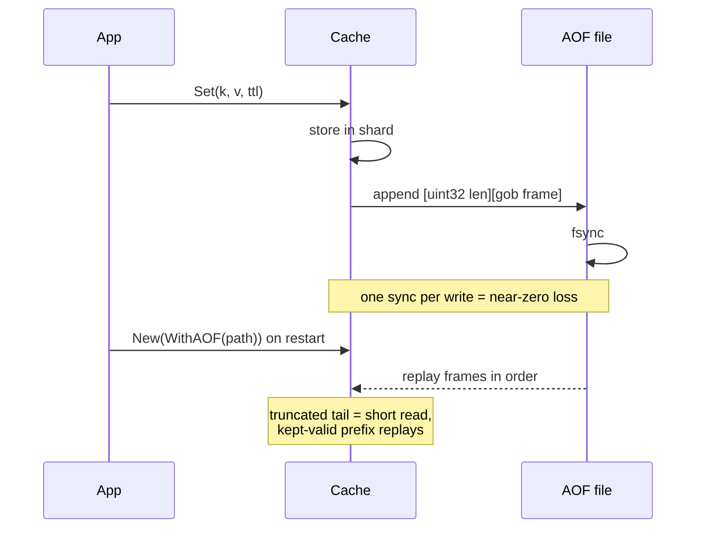

# cache-mem


[](https://pkg.go.dev/github.com/ubgo/cache-mem) [](https://goreportcard.com/report/github.com/ubgo/cache-mem) [](https://github.com/ubgo/cache-mem/actions/workflows/test.yml) [](https://github.com/ubgo/cache-mem/actions/workflows/lint.yml)  [](https://github.com/ubgo/cache-mem/tags) [](./LICENSE) 


In-memory cache for Go: sharded LRU / W-TinyLFU, with snapshot & AOF persistence.

`cache-mem` is the in-process adapter for [`github.com/ubgo/cache`](https://github.com/ubgo/cache). It is a fast, sharded, weight-aware in-memory cache with two pluggable eviction policies (classic **LRU** and a Caffeine-style **Adaptive Window-TinyLFU**), optional **point-in-time snapshots**, periodic **checkpointing**, and **append-only-file (AOF) durability** for near-zero-loss restarts. It implements the full `cache.Cache` interface and passes the shared `cachetest.Run` conformance suite, so it is a drop-in for any code written against the ubgo cache contract.

> **Documentation:** a full per-feature cookbook with use cases and runnable snippets for every option, policy, and method lives in [`docs/README.md`](docs/README.md).

## Why cache-mem

- **No network, no serialization tax.** Values live in process memory; reads are a sharded map lookup plus a defensive copy.
- **High hit rates out of the box.** The default policy is Adaptive W-TinyLFU, which resists one-hit-wonder floods and scan-heavy access patterns far better than plain LRU.
- **Low lock contention.** Keys are hashed across N independent shards, each with its own mutex and its own policy state.
- **Survives restarts when you want it to.** Choose periodic checkpoints (cheap, lossy to the last checkpoint) or AOF (fsync per write, near-zero loss), or both.
- **Size-aware.** Cap by entry count, by weighed byte size, or both, with a custom weigher.
- **Conformance-tested.** The same suite that validates every ubgo cache backend validates this one.

## Features

- Sharded storage (default 16 shards, rounded up to a power of two) for concurrency.
- Two eviction policies: `LRU` and `AdaptiveWTinyLFU` (default).
- Entry-count cap (`WithMaxEntries`) and weighed byte cap (`WithMaxBytes`) with a custom `Weigher`.
- Lazy TTL expiry on read plus an optional background sweeper (`WithSweepInterval`).
- Eviction callback with cause (`WithOnEvict`).
- Pluggable clock for deterministic tests (`WithClock`).
- `SnapshotTo` / `RestoreFrom` / `RestoreFromFile` for warm restarts (remaining-TTL preserved).
- Periodic atomic checkpointing (`WithCheckpoint`).
- Append-only-file durability with replay-on-start and `CompactAOF`.
- Rich `Stats()` including evictions broken down by cause.

## Install

```bash
go get github.com/ubgo/cache-mem
```

Requires Go 1.24+.

## Quick start

```go
package main

import (
	"context"
	"fmt"
	"time"

	memcache "github.com/ubgo/cache-mem"
)

func main() {
	c := memcache.New(
		memcache.WithMaxEntries(100_000),
		memcache.WithMaxBytes(256<<20),
	)
	defer c.Close()

	ctx := context.Background()
	_ = c.Set(ctx, "user:1", []byte("alice"), 5*time.Minute)

	v, err := c.Get(ctx, "user:1")
	if err != nil {
		panic(err)
	}
	fmt.Println(string(v)) // alice
}
```

## Architecture

### W-TinyLFU admission and segmentation



### Sharding and eviction flow



### AOF write path and replay



## Detailed usage

### Construction: `New` and options

`New(opts ...Option) *Cache` builds the cache. Always `Close()` it to stop the background sweeper / checkpoint goroutines and flush the AOF handle.

```go
c := memcache.New(
	memcache.WithShards(32),
	memcache.WithMaxEntries(1_000_000),
	memcache.WithMaxBytes(512<<20),
	memcache.WithPolicy(memcache.AdaptiveWTinyLFU),
)
defer c.Close()
```

#### `WithShards(n int)`

Sets the shard count (default 16). Rounded **up** to the next power of two (so `WithShards(20)` gives 32). More shards reduce lock contention under heavy concurrent write load at the cost of slightly coarser per-shard capacity buckets (caps are divided by shard count).

```go
c := memcache.New(memcache.WithShards(64))
```

#### `WithMaxEntries(n int64)`

Caps total entries. The global cap is divided across shards (`n / shards`, minimum 1 per shard). When a shard is full, the active policy chooses a victim on insert. `0` (default) means unbounded entry count.

```go
c := memcache.New(memcache.WithMaxEntries(50_000))
```

#### `WithMaxBytes(n int64)`

Caps total weighed size in bytes. Like the entry cap, it is enforced per-shard (`n / shards`). After every insert/overwrite the shard trims policy-chosen victims (coldest-first) until it is back under its byte budget. `0` (default) means unbounded.

```go
c := memcache.New(memcache.WithMaxBytes(256 << 20)) // 256 MiB
```

#### `WithWeigher(w Weigher)`

Overrides the per-entry cost function used by `WithMaxBytes`. The default counts raw value bytes (`len(val)`). Use a custom weigher to account for key size, struct overhead, or to weight some values more heavily.

```go
c := memcache.New(
	memcache.WithMaxBytes(64<<20),
	memcache.WithWeigher(func(v []byte) int64 { return int64(len(v)) + 48 }),
)
```

#### `WithOnEvict(fn func(key string, cause cache.EvictionCause))`

Registers a callback fired for **every** eviction with its cause (`EvictSize`, `EvictExpired`, `EvictExplicit`, `EvictReplaced`). The callback runs while the shard lock is held — keep it cheap and non-blocking; do not call back into the cache.

```go
c := memcache.New(memcache.WithOnEvict(func(k string, cause cache.EvictionCause) {
	log.Printf("evicted %s (%v)", k, cause)
}))
```

#### `WithSweepInterval(d time.Duration)`

Runs a background goroutine that proactively drops expired entries every `d`, in addition to lazy expiry on read. Without it, expired entries are only reclaimed when next accessed (or when iterated/snapshotted). Stopped by `Close()`.

```go
c := memcache.New(memcache.WithSweepInterval(30 * time.Second))
```

#### `WithClock(fn func() time.Time)`

Overrides the time source. Intended for deterministic tests.

```go
now := time.Now()
c := memcache.New(memcache.WithClock(func() time.Time { return now }))
```

#### `WithPolicy(p Policy)`

Selects the eviction algorithm. Two values:

- `memcache.LRU` — classic least-recently-used. Simple, low overhead.
- `memcache.AdaptiveWTinyLFU` — **default.** A small LRU admission window in front of a segmented-LRU (probation/protected) main region, gated by an aging Count-Min frequency sketch. Substantially higher hit rates on skewed (Zipfian) and scan-heavy workloads, at a small memory cost for the sketch.

```go
lruCache := memcache.New(memcache.WithPolicy(memcache.LRU))
wtinyCache := memcache.New(memcache.WithPolicy(memcache.AdaptiveWTinyLFU))
```

#### `WithCheckpoint(path string, interval time.Duration)`

Periodically snapshots the whole cache to `path` every `interval`, and writes a final checkpoint on `Close()`. The write is atomic (temp file + `rename`), so a crash mid-write never leaves a truncated checkpoint. Pair with `RestoreFromFile` at startup for a crash-resilient warm cache (lossy to the last checkpoint).

```go
c := memcache.New(memcache.WithCheckpoint("/var/cache/app.ckpt", time.Minute))
_, _ = c.RestoreFromFile("/var/cache/app.ckpt")
defer c.Close()
```

#### `WithAOF(path string)`

Enables append-only-file durability. Every mutating operation (`Set`, `SetMulti`, `SetNX`, `Expire`, `Incr`, `Decr`, `Del`, `Flush`) is fsync-appended to `path`, and an existing log is replayed into memory on `New` before appends resume. This is near-zero-loss durability at the cost of one `fsync` per write. Composes with `WithCheckpoint`. Call `CompactAOF()` periodically to bound the log.

```go
c := memcache.New(memcache.WithAOF("/var/cache/app.aof"))
defer c.Close()
```

### Eviction policy types

```go
type Policy int

const (
	LRU Policy = iota
	AdaptiveWTinyLFU
)
```

`AdaptiveWTinyLFU` is the constructor default (selected by `defaults()` even though `LRU` is the numeric zero value).

### Snapshot, restore, checkpoint

#### `SnapshotTo(w io.Writer) error`

Writes a gob stream of all live (non-expired) entries to `w`. TTL is stored as the **remaining** duration so a restored entry never lives past its original deadline. Takes each shard lock briefly; concurrent operations remain safe.

```go
f, _ := os.Create("cache.snap")
_ = c.SnapshotTo(f)
_ = f.Close()
```

#### `RestoreFrom(r io.Reader) (int, error)`

Loads a stream written by `SnapshotTo`. Entries whose remaining TTL has already elapsed are skipped; existing keys are overwritten. Returns the number of entries restored.

```go
f, _ := os.Open("cache.snap")
n, err := c.RestoreFrom(f)
_ = f.Close()
fmt.Println("restored", n, "entries", err)
```

#### `RestoreFromFile(path string) (int, error)`

Convenience wrapper. A missing file is **not** an error (cold start) — it returns `(0, nil)`.

```go
n, _ := c.RestoreFromFile("/var/cache/app.ckpt")
```

#### `CompactAOF() error`

Rewrites the AOF to the minimal set of records that reproduces current live state (one `Set` per live entry), bounding unbounded log growth. Atomic (temp file + rename over the live log). No-op if AOF is not enabled.

```go
go func() {
	t := time.NewTicker(time.Hour)
	for range t.C {
		_ = c.CompactAOF()
	}
}()
```

### Statistics

`Stats() cache.Stats` returns a snapshot:

```go
s := c.Stats()
fmt.Printf("hits=%d misses=%d sets=%d deletes=%d evictions=%d entries=%d bytes=%d\n",
	s.Hits, s.Misses, s.Sets, s.Deletes, s.Evictions, s.Entries, s.Bytes)
for cause, n := range s.EvictionsByCause {
	fmt.Printf("  %v: %d\n", cause, n)
}
```

### Core cache operations

`Cache` implements the full `cache.Cache` interface: `Get`, `GetMulti`, `Has`, `TTL`, `Set`, `SetMulti`, `SetNX`, `Expire`, `Touch`, `Incr`, `Decr`, `Del`, `DeleteByPrefix`, `Flush`, `Iterate`, `Ping`, `Close`, `Stats`. After `Close()`, every operation returns `cache.ErrClosed` (`Close` itself is idempotent).

```go
ctx := context.Background()
_ = c.Set(ctx, "n", make([]byte, 8), 0)
v, _ := c.Incr(ctx, "n", 5)   // 5
v, _ = c.Decr(ctx, "n", 2)    // 3
ok, _ := c.SetNX(ctx, "n", []byte("x"), 0) // false, key exists
_ = c.DeleteByPrefix(ctx, "user:")
```

## FAQ

### Is cache-mem thread-safe?

Yes. Every operation acquires the relevant shard's mutex (or all shard mutexes briefly, for `Stats`/`Snapshot`/`Flush`). Returned values are defensive copies, so callers can mutate them freely.

### What is the default eviction policy?

`AdaptiveWTinyLFU`. It is selected by `defaults()` even though `LRU` is the numeric zero value. Pass `WithPolicy(memcache.LRU)` to opt into plain LRU.

### How is W-TinyLFU better than LRU?

LRU evicts purely by recency, so a one-time scan of many cold keys flushes the working set. W-TinyLFU keeps a tiny LRU admission window and only promotes a candidate into the main cache if its estimated frequency (from an aging Count-Min sketch) beats the victim it would replace. Scans and one-hit-wonders are rejected at the door.

### Should I use checkpoint or AOF?

Checkpoint is cheap (periodic atomic snapshot) but loses everything since the last checkpoint on a crash. AOF fsyncs every write for near-zero loss but costs one sync per write. They compose: AOF for durability, checkpoint to shorten replay time. Call `CompactAOF()` to bound AOF size.

### Are TTLs preserved across restart?

Yes. Snapshots and AOF store the **remaining** TTL, not an absolute deadline, so a restored entry expires relative to restore time and never outlives its original deadline.

### How are capacity caps enforced with sharding?

Global caps are divided by the shard count (minimum 1 per shard). Eviction is per-shard, decided by the active policy. A perfectly skewed key distribution can therefore evict slightly earlier than a single global cap would; more shards make the buckets finer.

### How does cache-mem compare to other Go caches?

| | cache-mem | ristretto | otter | golang-lru |
|---|---|---|---|---|
| Policy | LRU or Adaptive W-TinyLFU | Sampled TinyLFU | S3-FIFO / W-TinyLFU | LRU / 2Q / ARC |
| Sharded | Yes | Yes | Yes | No (single mutex) |
| Size-aware (byte cap) | Yes (custom weigher) | Yes (cost) | Yes | No |
| Snapshot / restore | Yes | No | No | No |
| AOF durability | Yes | No | No | No |
| ubgo/cache interface | Yes (conformance-tested) | No | No | No |

`cache-mem` is the choice when you want the ubgo cache contract plus optional persistence in one in-process package; reach for the others when you only need a raw map-like cache and no durability.

## Related

- [`github.com/ubgo/cache`](https://github.com/ubgo/cache) — the cache contract and shared helpers.
- [`github.com/ubgo/cache-cluster`](https://github.com/ubgo/cache-cluster) — peer-aware distribution on top of any backend.
