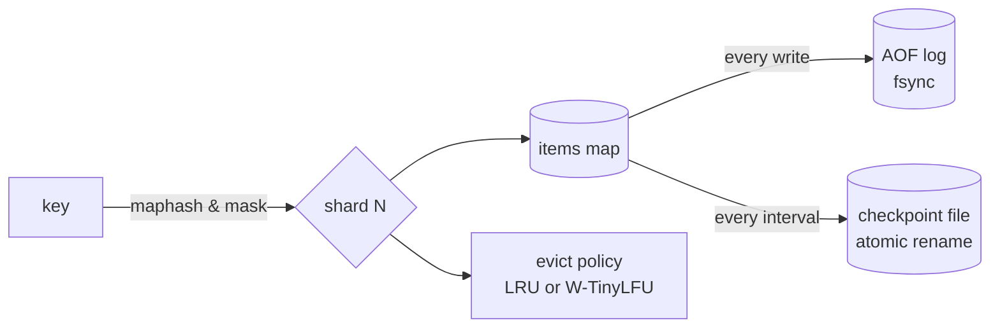

# cache-mem — feature cookbook

Exhaustive, example-driven reference for every exported identifier in
`github.com/ubgo/cache-mem` (package `memcache`). Every constructor, option,
policy, helper, and `cache.Cache` method has its own section with concrete
use cases and a runnable snippet.

Import path:

```go
import memcache "github.com/ubgo/cache-mem"
```

`memcache.Cache` implements [`cache.Cache`](https://github.com/ubgo/cache) and
passes the shared `cachetest.Run` conformance suite, so it is a drop-in for any
code written against the contract.

## Pages

- [Construction](construction.md) — `New`, the `Cache` type, lifecycle (`Close`), `Ping`.
- [Options](options.md) — every `WithX` option and the `Weigher`/`Option` types.
- [Eviction policies](policies.md) — the `Policy` type, `LRU`, `AdaptiveWTinyLFU`.
- [Persistence](persistence.md) — `SnapshotTo`, `RestoreFrom`, `RestoreFromFile`, `CompactAOF`, and the checkpoint/AOF model.
- [Cache methods](cache-methods.md) — every read/write/delete/iterate/stats method and its in-memory behavior.

## Capability matrix

| Exported symbol | Kind | Page |
|---|---|---|
| `New` | constructor | [Construction](construction.md#new) |
| `Cache` | type | [Construction](construction.md#cache) |
| `Option` | type | [Options](options.md#option) |
| `Weigher` | type | [Options](options.md#weigher) |
| `WithShards` | option | [Options](options.md#withshards) |
| `WithMaxEntries` | option | [Options](options.md#withmaxentries) |
| `WithMaxBytes` | option | [Options](options.md#withmaxbytes) |
| `WithWeigher` | option | [Options](options.md#withweigher) |
| `WithOnEvict` | option | [Options](options.md#withonevict) |
| `WithSweepInterval` | option | [Options](options.md#withsweepinterval) |
| `WithClock` | option | [Options](options.md#withclock) |
| `WithPolicy` | option | [Options](options.md#withpolicy) |
| `WithCheckpoint` | option | [Options](options.md#withcheckpoint) |
| `WithAOF` | option | [Options](options.md#withaof) |
| `Policy` | type | [Policies](policies.md#policy) |
| `LRU` | const | [Policies](policies.md#lru) |
| `AdaptiveWTinyLFU` | const | [Policies](policies.md#adaptivewtinylfu) |
| `(*Cache).SnapshotTo` | method | [Persistence](persistence.md#snapshotto) |
| `(*Cache).RestoreFrom` | method | [Persistence](persistence.md#restorefrom) |
| `(*Cache).RestoreFromFile` | method | [Persistence](persistence.md#restorefromfile) |
| `(*Cache).CompactAOF` | method | [Persistence](persistence.md#compactaof) |
| `Get` / `GetMulti` / `Has` / `TTL` | cache.Cache | [Cache methods](cache-methods.md#read) |
| `Set` / `SetMulti` / `SetNX` / `Expire` / `Touch` | cache.Cache | [Cache methods](cache-methods.md#write) |
| `Incr` / `Decr` | cache.Cache | [Cache methods](cache-methods.md#counters) |
| `Del` / `DeleteByPrefix` / `Flush` | cache.Cache | [Cache methods](cache-methods.md#delete) |
| `Iterate` | cache.Cache | [Cache methods](cache-methods.md#iterate) |
| `Ping` / `Close` / `Stats` | cache.Cache | [Cache methods](cache-methods.md#lifecycle) |

## Architecture at a glance


