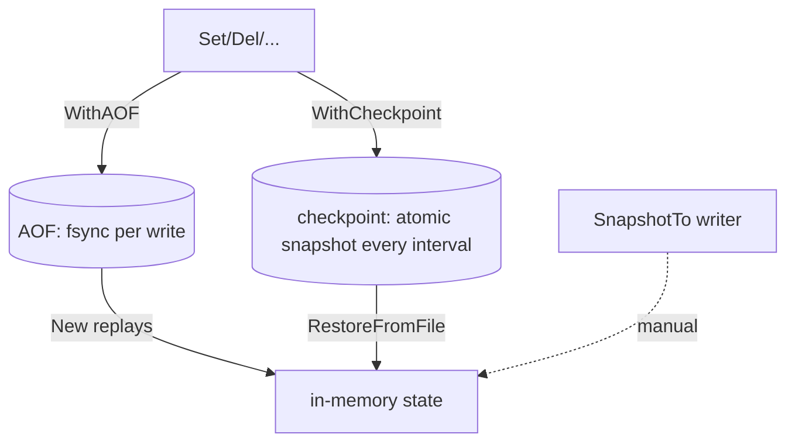

# Persistence

These methods are on the concrete `*memcache.Cache` (not on the `cache.Cache`
interface). TTLs are persisted as *remaining* duration, so a restored entry
never outlives its original deadline.



### SnapshotTo

`func (c *Cache) SnapshotTo(w io.Writer) error`

What it is: writes a gob stream of all live (non-expired) entries to `w`.
Takes each shard lock briefly; concurrent ops stay safe. Returns
`cache.ErrClosed` if closed.

Use cases:

- Manual warm-restart: snapshot on shutdown, restore on boot.
- Ship cache state to object storage (S3/GCS) for cross-host warm starts.

```go
f, _ := os.Create("cache.snap")
defer f.Close()
if err := c.SnapshotTo(f); err != nil {
	log.Fatal(err)
}
```

### RestoreFrom

`func (c *Cache) RestoreFrom(r io.Reader) (int, error)`

What it is: loads a stream written by `SnapshotTo`. Entries whose remaining TTL
already elapsed are skipped; existing keys are overwritten. Returns the number
restored.

Use cases:

- Restore from a snapshot stored anywhere readable (file, S3 body, pipe).
- Pre-warm a fresh cache from a peer's snapshot.

```go
f, _ := os.Open("cache.snap")
defer f.Close()
n, err := c.RestoreFrom(f)
log.Printf("restored %d entries (err=%v)", n, err)
```

### RestoreFromFile

`func (c *Cache) RestoreFromFile(path string) (int, error)`

What it is: convenience wrapper that opens `path` and calls `RestoreFrom`. A
missing file is **not** an error (cold start) — it returns `(0, nil)`.

Use cases:

- Startup warm-up paired with `WithCheckpoint` — safe even on first boot.
- One-liner restore without managing the file handle.

```go
c := memcache.New(memcache.WithCheckpoint("app.snap", time.Minute))
n, _ := c.RestoreFromFile("app.snap") // 0,nil if the file does not exist yet
log.Printf("warm-started with %d entries", n)
```

### CompactAOF

`func (c *Cache) CompactAOF() error`

What it is: rewrites the AOF to the minimal set of records that reproduces the
current live state (one `Set` per live entry), bounding unbounded log growth.
Atomic (temp file + rename). No-op if `WithAOF` was not set.

Use cases:

- Periodic maintenance (cron / ticker) so the replayed log stays small and
  `New` stays fast.
- Compact before a planned restart to minimize replay time.

```go
c := memcache.New(memcache.WithAOF("app.aof"))
defer c.Close()
go func() {
	for range time.Tick(30 * time.Minute) {
		if err := c.CompactAOF(); err != nil {
			log.Printf("aof compaction failed: %v", err)
		}
	}
}()
```
